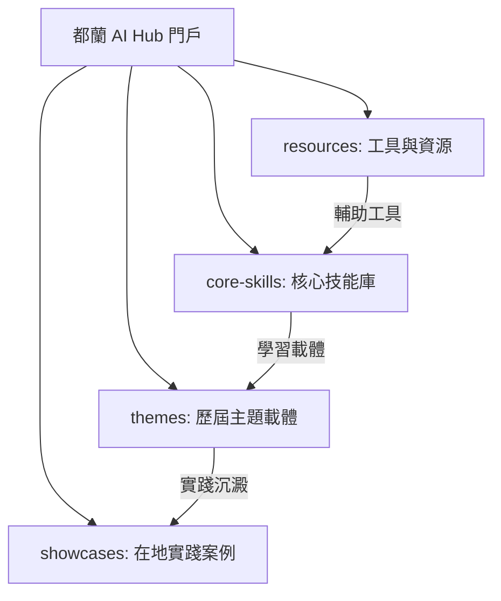

# 🌊 都蘭 AI 慢活共創營 ╳ 都蘭社區 AI Hub 知識庫 🚀

> **「一手拿滑鼠，一手摸泥土 —— 人生新舞台，AI 幫你開！」**

歡迎來到**都蘭社區 AI Hub 知識庫**！這裡不僅是「Hapa 的 AI 慢活共創營」的課程學習平台，更是都蘭在地居民、店家、小農與樂齡長輩共同建構的社區智慧中樞。

我們深信，科技不該是冷冰冰的程式碼，而是可以用最簡單的**「說話與拍照」**，來解決生活與工作上真實問題的溫暖工具。在這個共創營中，我們以「核心 AI 技能」為地基，將不同的在地應用主題（寫書創作、進銷存管理、民宿行銷）作為載體，在上課的過程中，順手將都蘭專屬的 AI 知識庫建立起來。

後來的學員除了參與當期的主題外，也可以在此參閱歷屆的主題內容與學員的實踐經驗，讓智慧在都蘭土地上持續滾動、增量累積。

---

## 🗺️ 知識庫導航地圖 (Navigational Map)

本知識庫主要分為四大板塊，您可以根據需求點擊進入：

### 1. ⚙️ [核心技能庫 (Core Skills)](file:///Users/wuulong/github/bmad-pa/events/classes/dulan-ai-hub-private/dulan-ai-hub/core-skills/README.md)
不論主題如何變換，這都是您必須掌握的 AI 核心兵器。我們將其轉譯為最簡單的手機操作與說話技巧：
*   🎙️ [語音輸入與逐字稿轉譯](file:///Users/wuulong/github/bmad-pa/events/classes/dulan-ai-hub-private/dulan-ai-hub/core-skills/01-voice-to-text.md)：用語音說故事、記錄農作與日常。
*   💬 [與 AI 溫暖對話的提示詞](file:///Users/wuulong/github/bmad-pa/events/classes/dulan-ai-hub-private/dulan-ai-hub/core-skills/02-prompt-engineering.md)：如何像跟鄰居聊天一樣，讓 AI 幫你寫文案。
*   📊 [凌亂資料的表格結構化](file:///Users/wuulong/github/bmad-pa/events/classes/dulan-ai-hub-private/dulan-ai-hub/core-skills/03-structured-data.md)：用拍照或說話，讓 AI 幫你記帳與管理客戶。
*   🎨 [相片辨識與文案行銷](file:///Users/wuulong/github/bmad-pa/events/classes/dulan-ai-hub-private/dulan-ai-hub/core-skills/04-marketing-content.md)：拍照辨識作物與生態，自動生成 FB/LINE 吸睛貼文。

### 2. 📅 [歷屆主題庫 (Themes)](file:///Users/wuulong/github/bmad-pa/events/classes/dulan-ai-hub-private/dulan-ai-hub/themes/README.md)
收錄歷屆共創營的主題課程計畫與上課紀錄。您可以點選過去的主題進行自主學習：
*   🌱 **當期主題**：[2026 夏・AI 慢活共創營 (第一期)](file:///Users/wuulong/github/bmad-pa/events/classes/dulan-ai-hub-private/dulan-ai-hub/themes/2026-summer-slow-living/README.md)
    *   ✍️ **主題一：寫書創作** (7/10、7/24) - 錄音寫故事、品牌文案。
    *   💰 **主題二：進銷存管理** (8/7、8/21) - AI 記帳、客戶表單管理。
    *   🌿 **主題三：民宿與行銷** (9/4、9/18) - 生態辨識、FB/LINE 行銷貼文生成。

### 3. 🤝 [社區創生案例庫 (Showcases)](file:///Users/wuulong/github/bmad-pa/events/classes/dulan-ai-hub-private/dulan-ai-hub/showcases/README.md)
「以物易物交學費嘛通！」這裡記錄了都蘭居民與小農，如何將 AI 實際應用在自家店面、農作與民宿的真實故事，以及他們的「以物易物」溫暖成果。

### 4. 📱 [工具與資源 (Resources)](file:///Users/wuulong/github/bmad-pa/events/classes/dulan-ai-hub-private/dulan-ai-hub/resources/README.md)
提供適合手機操作的 AI 軟體下載、設定指南，以及在地實體陪伴教室（都蘭教室、台東市教室）的聯絡與開放時間。

---

## 🤝 雙師陪伴與共創機制

我們強調**「在地陪伴」**與**「共同建構」**：
*   **導師與教練**：TAIDE 第一代PM **哈爸 (許武龍)** 線上導航，在地教練 **阿鐘 (陳豊鍾)** 與 **陳品碩** 實體教室現場手把手陪伴。
*   **共創沉澱**：每堂課結束後，教練與學員的互動、Q&A、以及上課錄音，都會由 AI 整理成 **[課程紀錄 (Session Records)]** 放入對應的主題目錄中。這讓知識庫能夠隨著每次上課，順手、自然地成長。
