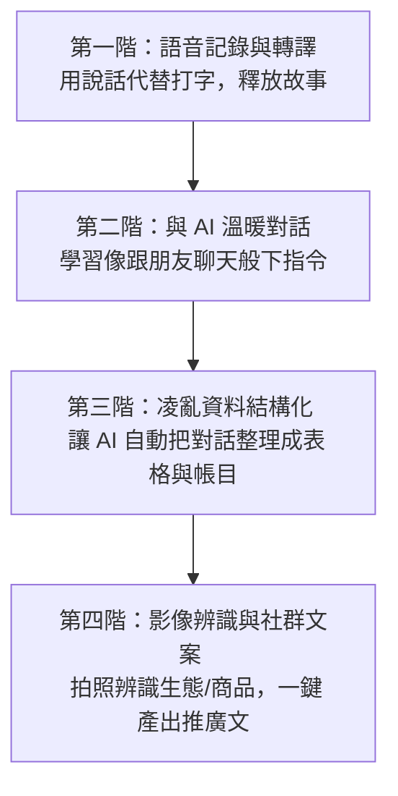

# ⚙️ 核心技能庫 (Core AI Skills)

在「都蘭 AI 慢活共創營」中，不管每期上課的「主題」（寫書、民宿、記帳）怎麼變換，底層所使用的 AI 核心技能都是相通的。

本版塊收錄了最關鍵的四項 AI 核心技能，以最適合手機操作、最口語直覺的方式撰寫。您可以將這些技能視為「積木」，學會了這些積木，就能自由組合應用在生活與工作中的各種場景。

---

## 🪜 AI 技能演化梯 (The Skills Ladder)

為了讓大家循序漸進學習，不產生科技焦慮，我們將核心技能設計成一個低難度、高體感的演化路徑：

---

## 📚 核心技能手冊列表

點擊下方連結，開啟您的 AI 核心技能學習：

1.  🎙️ **[01. 語音輸入與逐字稿轉譯](file:///Users/wuulong/github/bmad-pa/events/classes/dulan-ai-hub-private/dulan-ai-hub/core-skills/01-voice-to-text.md)**
    *   *適合場景*：不習慣手機打字的長輩、想記錄農作日常的小農、想口述歷史與故事的創作者。
    *   *核心心法*：說話就是寫作，AI 是你的專屬速記官。
2.  💬 **[02. 提示詞工程 (與 AI 溫暖對話)](file:///Users/wuulong/github/bmad-pa/events/classes/dulan-ai-hub-private/dulan-ai-hub/core-skills/02-prompt-engineering.md)**
    *   *適合場景*：覺得 AI 回答很機械化、不知道怎麼問問題的人。
    *   *核心心法*：不用背指令，把 AI 當成實體教室的教練，用台東在地人的溫暖口吻來溝通。
3.  📊 **[03. 凌亂資料的表格結構化](file:///Users/wuulong/github/bmad-pa/events/classes/dulan-ai-hub-private/dulan-ai-hub/core-skills/03-structured-data.md)**
    *   *適合場景*：每天被收據、出貨單、客戶預約訊息淹沒的店家與小農。
    *   *核心心法*：把雜亂的「話語」和「照片」丟給 AI，它能自動幫你排好表格。
4.  🎨 **[04. 相片辨識與多媒體文案行銷](file:///Users/wuulong/github/bmad-pa/events/classes/dulan-ai-hub-private/dulan-ai-hub/core-skills/04-marketing-content.md)**
    *   *適合場景*：民宿老闆需要介紹生態、小農推廣無毒作物、需要寫 FB/LINE 宣傳貼文。
    *   *核心心法*：拍張照，讓 AI 幫你寫出有故事溫度的推廣文。
