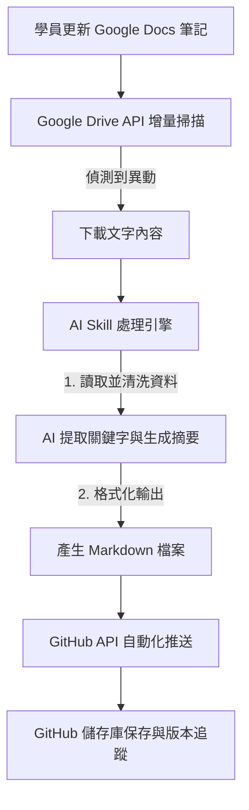

# 📄 系統架構與流程圖 (System Architecture & Workflow Diagram)

本文件定義了整個自動化教學歷程系統的資料流向、各系統節點的職責，以及異常處理機制。

## 1. 系統節點與職責

- **輸入端 (Google Docs / Drive API)：** 作為學員填寫筆記的介面。系統透過 Drive API 定期掃描，並採用增量更新（Incremental Update）策略，僅篩選出新建立或有異動的筆記，避免重複掃描與 API 點數浪費。
    
- **處理端 (AI Skill 引擎)：** 接收來自 Google Docs 的文字內容，負責結構化解析、關鍵字提取（Metadata Extraction）與摘要生成，並將結果轉換為標準的 `.md` (Markdown) 格式檔案。
    
- **儲存端 (GitHub Repository)：** 作為最終的學習歷程資料庫。AI Skill 處理完畢後，透過 GitHub API（Git 機器人）自動將 Markdown 檔案 `git commit` 並 `push` 到學員專屬或班級的儲存庫中，達成版本控制與歷程追蹤。

## 2. 資料流動程序（Mermaid 流程圖示）

