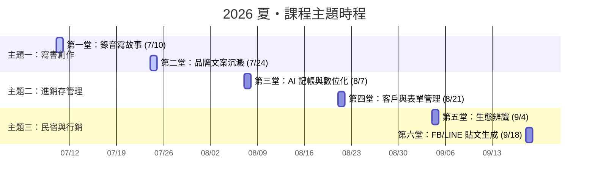

# 🌱 2026 夏・Hapa 的 AI 慢活共創營 (第一期)

> **「雙師陪伴式共學堂 —— 不講複雜代碼，只用說話與拍照，解決你的真實問題。」**

本期共創營專為台東在地居民、店家、小農與退休創作者設計。我們利用兩週一次、每次兩小時的陪伴時光，帶領大家跨越科技門檻，將 AI 融入慢活日常。

---

## 📅 課程時間表與主題地圖

上課時間為**每兩週五的晚上 19:30 - 21:30**。前一小時 (19:30-20:30) 為哈爸線上授課與地圖導航，後一小時 (20:30-21:30) 為在地實體陪伴與實戰練習。

---

## 🗺️ 主題單元導覽

### ✍️ 主題一：寫書創作
用「說話」代替打字，寫出你的生命故事與品牌靈魂。
*   🎙️ **[07/10 第一堂：錄音寫故事](file:///Users/wuulong/github/bmad-pa/events/classes/dulan-ai-hub-private/dulan-ai-hub/themes/2026-summer-slow-living/theme-1-writing/session-1-recording.md)**
    *   *學習路徑*：開啟錄音 ➔ 語音轉譯 ➔ AI 潤飾 ➔ 完成首篇都蘭心情日記。
    *   📝 *共創紀錄*：[第一堂課程記錄](file:///Users/wuulong/github/bmad-pa/events/classes/dulan-ai-hub-private/dulan-ai-hub/themes/2026-summer-slow-living/theme-1-writing/session-records/session-1-log.md)
*   🎙️ **[07/24 第二堂：品牌文案與故事沉澱](file:///Users/wuulong/github/bmad-pa/events/classes/dulan-ai-hub-private/dulan-ai-hub/themes/2026-summer-slow-living/theme-1-writing/session-2-copywriting.md)**
    *   *學習路徑*：口述產品特色 ➔ 使用溫暖提示詞 ➔ 生成有故事感的推廣文案。
    *   📝 *共創紀錄*：[第二堂課程記錄](file:///Users/wuulong/github/bmad-pa/events/classes/dulan-ai-hub-private/dulan-ai-hub/themes/2026-summer-slow-living/theme-1-writing/session-records/session-2-log.md)

### 💰 主題二：進銷存管理
用 AI 幫你理清帳目，不再為繁瑣的訂單和數字傷透腦筋。
*   📊 **[08/07 第三堂：AI 記帳與手寫帳單數位化](file:///Users/wuulong/github/bmad-pa/events/classes/dulan-ai-hub-private/dulan-ai-hub/themes/2026-summer-slow-living/theme-2-inventory/session-3-bookkeeping.md)**
    *   *學習路徑*：拍照手寫帳單 ➔ 丟給 AI 辨識 ➔ 自動生成 Markdown 記帳表格。
    *   📝 *共創紀錄*：[第三堂課程記錄](file:///Users/wuulong/github/bmad-pa/events/classes/dulan-ai-hub-private/dulan-ai-hub/themes/2026-summer-slow-living/theme-2-inventory/session-records/session-3-log.md)
*   📊 **[08/21 第四堂：客戶表單與預約管理](file:///Users/wuulong/github/bmad-pa/events/classes/dulan-ai-hub-private/dulan-ai-hub/themes/2026-summer-slow-living/theme-2-inventory/session-4-forms.md)**
    *   *學習路徑*：整理客人的 LINE 預約訊息 ➔ AI 自動抓取姓名、時間、數量 ➔ 生成排班時程表。
    *   📝 *共創紀錄*：[第四堂課程記錄](file:///Users/wuulong/github/bmad-pa/events/classes/dulan-ai-hub-private/dulan-ai-hub/themes/2026-summer-slow-living/theme-2-inventory/session-records/session-4-log.md)

### 🌿 主題三：民宿與行銷
拍下一張照片，讓 AI 幫你把都蘭的自然生態與慢活故事行銷出去。
*   🎨 **[09/04 第五堂：生態與在地特色辨識](file:///Users/wuulong/github/bmad-pa/events/classes/dulan-ai-hub-private/dulan-ai-hub/themes/2026-summer-slow-living/theme-3-homestay-marketing/session-5-ecology.md)**
    *   *學習路徑*：拍攝民宿周邊動植物 ➔ AI 辨識品種與背景故事 ➔ 生成生態導覽卡片。
    *   📝 *共創紀錄*：[第五堂課程記錄](file:///Users/wuulong/github/bmad-pa/events/classes/dulan-ai-hub-private/dulan-ai-hub/themes/2026-summer-slow-living/theme-3-homestay-marketing/session-records/session-5-log.md)
*   🎨 **[09/18 第六堂：FB/LINE 慢活行銷貼文](file:///Users/wuulong/github/bmad-pa/events/classes/dulan-ai-hub-private/dulan-ai-hub/themes/2026-summer-slow-living/theme-3-homestay-marketing/session-6-marketing.md)**
    *   *學習路徑*：選定民宿/產品照片 ➔ 結合在地情感 ➔ 生成吸睛的 FB/LINE 行銷長短文。
    *   📝 *共創紀錄*：[第六堂課程記錄](file:///Users/wuulong/github/bmad-pa/events/classes/dulan-ai-hub-private/dulan-ai-hub/themes/2026-summer-slow-living/theme-3-homestay-marketing/session-records/session-6-log.md)

---

## 📍 雙實體教室與陪伴陣容

*   **都蘭教室**：【四季八里自然莊園】（教練阿鐘現場陪伴，解答您的疑難雜症）
*   **台東市教室**：【生活管家就醬點】（教練陳品碩現場手把手輔導）
*   **線上導師**：哈爸 (許武龍) —— 竹科晶片設計資深架構師，帶領大家用最接地氣的邏輯理解 AI。
*   **學費說明**：本期學費為 $3,000 元（共 12 週，每兩週一次）。**歡迎以自產咖啡豆、米、蜂蜜或勞務支援進行以物易物折抵！**
