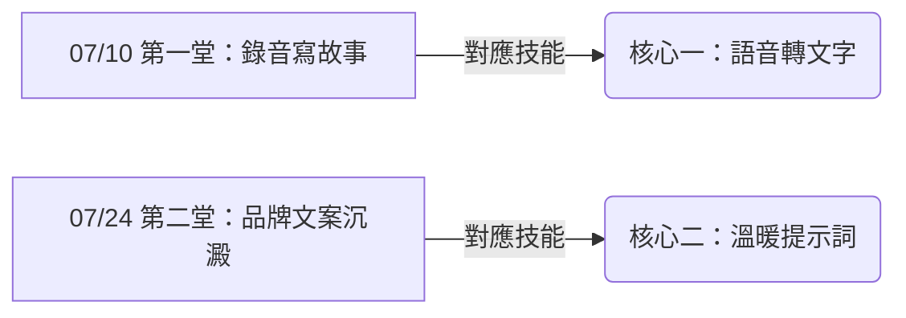

# ✍️ 主題一：寫書創作

> **「用最真實的聲音，寫出屬於你的故事。」**

本主題做為我們 AI 共創營的第一個里程碑。我們將聚焦於如何**讓大家透過『說話』和『說故事』來完成寫作**。
許多人害怕寫作、覺得自己文筆不好，但其實每個人都是天生的說故事者。在都蘭，我們用紙筆和錄音把日常種種記錄下來，再透過 AI 的修飾，讓這些話語幻化成通順動人的生命故事與品牌文案。

---

## 🗺️ 本主題學習地圖

本主題共包含兩堂課，我們將在這兩堂課中結合核心技能：

---

## 📚 課程計畫與實作路徑

1.  🎙️ **[07/10 第一堂：錄音寫故事](file:///Users/wuulong/github/bmad-pa/events/classes/dulan-ai-hub-private/dulan-ai-hub/themes/2026-summer-slow-living/theme-1-writing/session-1-recording.md)**
    *   *目標*：學會用語音錄製自己的想法，並轉譯為第一篇「都蘭心情日記」。
    *   *實作練習*：錄下一段 1~2 分鐘的心情，並轉成乾淨短文。
2.  🎙️ **[07/24 第二堂：品牌文案與故事沉澱](file:///Users/wuulong/github/bmad-pa/events/classes/dulan-ai-hub-private/dulan-ai-hub/themes/2026-summer-slow-living/theme-1-writing/session-2-copywriting.md)**
    *   *目標*：結合溫暖提示詞，為自家產品或個人品牌寫出一篇有溫度的推廣文案。
    *   *實作練習*：口述產品特色，生成 200 字 FB 推廣文。

---

## 📝 課堂共創紀錄 (Session Records)

課堂上的真實錄音逐字稿、教練與學員的互動記錄、以及當堂的 Q&A 都存放在這裡：
*   📂 **[課程紀錄目錄](file:///Users/wuulong/github/bmad-pa/events/classes/dulan-ai-hub-private/dulan-ai-hub/themes/2026-summer-slow-living/theme-1-writing/session-records/README.md)**
    *   📝 [07/10 第一堂課程紀錄](file:///Users/wuulong/github/bmad-pa/events/classes/dulan-ai-hub-private/dulan-ai-hub/themes/2026-summer-slow-living/theme-1-writing/session-records/session-1-log.md)
    *   📝 [07/24 第二堂課程紀錄](file:///Users/wuulong/github/bmad-pa/events/classes/dulan-ai-hub-private/dulan-ai-hub/themes/2026-summer-slow-living/theme-1-writing/session-records/session-2-log.md)
