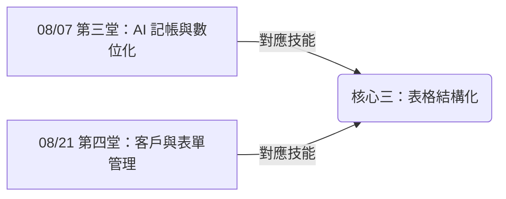

# 💰 主題二：進銷存管理

> **「用 AI 理清繁雜的訂單與帳目，讓小店經營更輕鬆自在。」**

本主題針對台東在地店家、民宿主與小農的日常痛點設計。每天出貨、記帳、核對客人的預約與購買資訊，總是耗費大量精力，有時還會漏掉關鍵訊息。

在這裡，我們將利用 AI 的**「表格結構化」**能力，教大家如何把手寫收據、白板照片、或是 LINE 群組裡亂糟糟的留言，一鍵轉換成清晰好讀的電子表格，告別舊式記帳的混亂。

---

## 🗺️ 本主題學習地圖

本主題包含兩堂課，重點對應的核心技能為：

---

## 📚 課程計畫與實作路徑

1.  📊 **[08/07 第三堂：AI 記帳與手寫帳單數位化](file:///Users/wuulong/github/bmad-pa/events/classes/dulan-ai-hub-private/dulan-ai-hub/themes/2026-summer-slow-living/theme-2-inventory/session-3-bookkeeping.md)**
    *   *目標*：拍照手寫記帳單，交給 AI 辨識並自動生成 Markdown 收支表格。
    *   *實作練習*：拍下一張手寫收據並轉成電子表格。
2.  📊 **[08/21 第四堂：客戶表單與預約管理](file:///Users/wuulong/github/bmad-pa/events/classes/dulan-ai-hub-private/dulan-ai-hub/themes/2026-summer-slow-living/theme-2-inventory/session-4-forms.md)**
    *   *目標*：將 LINE 對話中的客戶預約或訂單訊息，用 AI 抓取並自動轉換為「出貨排程表」。
    *   *實作練習*：將一段混亂的 LINE 預約訊息轉換為時間排序的表格。

---

## 📝 課堂共創紀錄 (Session Records)

本主題的課堂記錄、共創金流表格與 Q&A 存放在這裡：
*   📂 **[課程紀錄目錄](file:///Users/wuulong/github/bmad-pa/events/classes/dulan-ai-hub-private/dulan-ai-hub/themes/2026-summer-slow-living/theme-2-inventory/session-records/README.md)**
    *   📝 [08/07 第三堂課程紀錄](file:///Users/wuulong/github/bmad-pa/events/classes/dulan-ai-hub-private/dulan-ai-hub/themes/2026-summer-slow-living/theme-2-inventory/session-records/session-3-log.md)
    *   📝 [08/21 第四堂課程紀錄](file:///Users/wuulong/github/bmad-pa/events/classes/dulan-ai-hub-private/dulan-ai-hub/themes/2026-summer-slow-living/theme-2-inventory/session-records/session-4-log.md)
