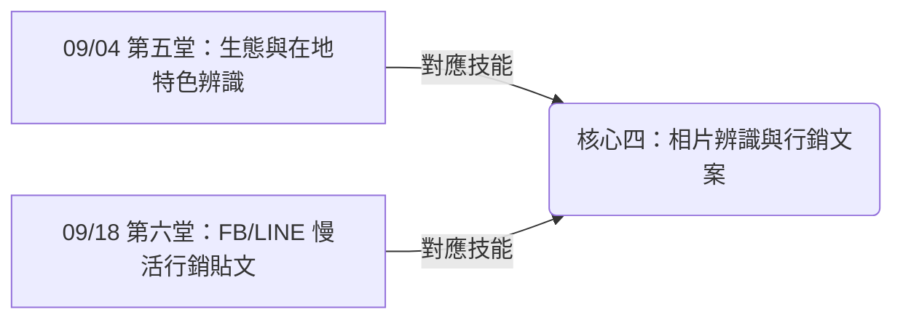

# 🌿 主題三：民宿與行銷

> **「用相機記錄都蘭山海的美，讓 AI 幫你寫出打動人心的行銷故事。」**

台東都蘭擁有得天獨厚的自然美景與豐富的原住民人文生態。本主題將帶領學員們，將大自然的美景與在地好物，透過 AI 的**「影像辨識」**與**「多媒體行銷」**技能，包裝成充滿慢活風情的 FB/LINE 推廣文案。

我們不學死板的廣告推銷，而是要學如何用「拍照與說真心話」，讓住在都市的旅人看見都蘭的悠閒與溫度，吸引他們前來體驗都蘭生活。

---

## 🗺️ 本主題學習地圖

本主題包含兩堂課，重點對應的核心技能為：

---

## 📚 課程計畫與實作路徑

1.  🎨 **[09/04 第五堂：生態與在地特色辨識](file:///Users/wuulong/github/bmad-pa/events/classes/dulan-ai-hub-private/dulan-ai-hub/themes/2026-summer-slow-living/theme-3-homestay-marketing/session-5-ecology.md)**
    *   *目標*：拍照辨識民宿周圍的動植物或在地農特產，AI 介紹其背景故事，製作生態導覽卡片。
    *   *實作練習*：拍下一張植物或昆蟲照片並生成導覽文案。
2.  🎨 **[09/18 第六堂：FB/LINE 慢活行銷貼文](file:///Users/wuulong/github/bmad-pa/events/classes/dulan-ai-hub-private/dulan-ai-hub/themes/2026-summer-slow-living/theme-3-homestay-marketing/session-6-marketing.md)**
    *   *目標*：結合都蘭慢活情感，為商品或民宿房間照片，生成有溫度的社群平台宣傳貼文。
    *   *實作練習*：拍照並撰寫一篇吸引都市人來放鬆的慢活文案。

---

## 📝 課堂共創紀錄 (Session Records)

本主題的課程花絮、生態導覽文案與 Q&A 紀錄存放在這裡：
*   📂 **[課程紀錄目錄](file:///Users/wuulong/github/bmad-pa/events/classes/dulan-ai-hub-private/dulan-ai-hub/themes/2026-summer-slow-living/theme-3-homestay-marketing/session-records/README.md)**
    *   📝 [09/04 第五堂課程紀錄](file:///Users/wuulong/github/bmad-pa/events/classes/dulan-ai-hub-private/dulan-ai-hub/themes/2026-summer-slow-living/theme-3-homestay-marketing/session-records/session-5-log.md)
    *   📝 [09/18 第六堂課程紀錄](file:///Users/wuulong/github/bmad-pa/events/classes/dulan-ai-hub-private/dulan-ai-hub/themes/2026-summer-slow-living/theme-3-homestay-marketing/session-records/session-6-log.md)
