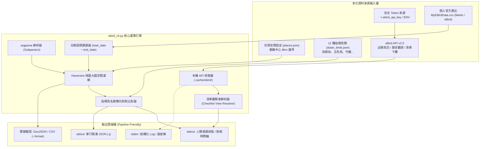

# 🦅 eBird 在地鳥類生態系系觀測與即時鳥況 CLI 規格書 (CGS v2.0 實作升級版)

> **版本**：v2.0 (基於實戰除錯與需求回饋全面升級)  
> **編寫日期**：2026-09-03  
> **歸檔路徑**：`events/classes/dulan-ai-hub-private/dulan-ai-hub/topics/inaturalist/ebird-dulan-cli-spec.md`  
> **核心程式碼**：`scripts/gis/ebird_cli.py`  
> **手冊對齊**：`scripts/manuals/ebird_cli.md`  
> **相容設定檔**：`data/ecology/places.json` (空間共用), `data/ecology/dulan_birds.json` (12 種指標鳥)

---

## 🎯 1. 專案背景與核心定位

本工具為 Cornell Lab of Ornithology（康乃爾鳥類學實驗室）旗下權威平台 **eBird API v2.0** 的專業 AI-Native 命令列工具。
專為台東都蘭及台灣各地賞鳥人、地方生態系系走讀解說員與 AI Agent 打造。

與先前版本相比，v2.0 規格融入了**「Merlin App 行為機制解密」**、**「歷史日期區間探勘 (`historic`)」**、**「個人 CSV 旅程時間軸 (`trip`)」** 以及 **「嚴格觀察者過濾 (`--user`)」** 等深度實戰能力，消滅了所有手動撰寫臨時腳本的痛點。

### 核心設計原則：
1. **與 `inat_cli` 雙向 100% Config 相容**：
   * **空間定義**：共用 [`data/ecology/places.json`](file:///Users/wuulong/github/bmad-pa/data/ecology/places.json)，以都蘭中心坐標 (`22.875, 121.21`) 與 8.0km 半徑為單一真實來源。
   * **名錄定義**：格式對齊原民植物名錄，收錄 12 種都蘭經典指標鳥種 (`data/ecology/dulan_birds.json`)。
2. **CGS v2.0 硬性合規 (The 7 Pillars)**：
   * 顯式版號宣告 `__cli_spec_version__ = "2.0"`。
   * 原生標準庫相依（`urllib`, `json`, `csv`），零外部套件負擔，極速啟動。
   * 標準串流分離（`stdout` 乾淨資料/緊湊 JSON，`stderr` 結構化日誌）。
3. **無痛安全 Key 管理**：
   * 優先順序：`EBIRD_API_KEY` 環境變數 $\rightarrow$ 本地 `~/.ebird_api_key` $\rightarrow$ 專案 `.env` $\rightarrow$ CLI 旗標 `--api-key`。

---

## 🏛️ 2. 系統架構與資料管線



---

## 🛠️ 3. 完整命令列規格 (Subcommands Specification)

### 3.1 共通全域參數 (Global Flags)
* `-j, --json`：啟用單行緊湊 JSON 輸出，降低 Token 消耗 80% 以上。
* `-q, --quiet`：極簡輸出（純 TSV 格式）。
* `-v, --verbose`：詳細除錯日誌（導向 `stderr`）。
* `-n, --limit`：回傳筆數上限（預設 20 筆）。
* `-o, --output`：指定輸出檔案（預設 `-` 代表 stdout）。
* `--api-key`：手動傳入 eBird API Token。
* `--place`：空間代號（預設讀取 `places.json` 之 `"dulan"`）。
* `--place-config`：自訂空間定義檔路徑。
* `--lat`, `--lng`, `--radius`：涵蓋空間幾何範圍。
* `--log-file`：同步記錄日誌至檔案。
* `--no-cache`：強制跳過本機快取重新請求 API。

---

### 3.2 核心子命令詳細定義

#### ① `recent`：近期即時鳥況檢索
```bash
python3 scripts/gis/ebird_cli.py recent [--place dulan] [--back 14] [--user "NAME"] [-n 20] [-j]
```
* **底層 API**：`GET /v2/data/obs/geo/recent`
* **升級特性**：支援 `--user "NAME"` 參數。若傳入觀察者姓名，CLI 在底層自動批次下鑽該區域的所有清單，只輸出該觀察者的目擊紀錄。
* **回傳欄位**：物種名稱、拉丁學名、數量（身/聲）、地點、座標、清單編號 (`subId`)、觀察者名稱。

#### ② `historic`：歷史特定日期區間鳥況查詢
```bash
python3 scripts/gis/ebird_cli.py historic --date YYYY-MM-DD [--end-date YYYY-MM-DD] [--place dulan] [--user "NAME"]
```
* **底層 API**：`GET /v2/data/obs/{regionCode}/historic/{y}/{m}/{d}`
* **升級特性**：**突破 30 天限制**，可回溯查詢歷史上任何日期區間（例如：`--date 2026-04-13 --end-date 2026-04-26`）。自動透過 Haversine 演演算法篩選出都蘭半徑 8km 內的公共紀錄。

#### ③ `hotspots`：熱門賞鳥熱點探勘
```bash
python3 scripts/gis/ebird_cli.py hotspots [--place dulan] [-n 15]
```
* **底層 API**：`GET /v2/ref/hotspot/geo`
* **功能**：列出都蘭周邊經認證的熱門賞鳥點（水往上流、都蘭山步道、加母子灣、興隆等）與歷年累積鳥種數。

#### ④ `notable`：罕見與稀有鳥種快訊
```bash
python3 scripts/gis/ebird_cli.py notable [--place dulan] [--back 14]
```
* **底層 API**：`GET /v2/data/obs/geo/recent/notable`
* **功能**：即時掌握周邊過境迷鳥、稀有特有種目擊快報。

#### ⑤ `match`：指標鳥類名錄即時比對
```bash
python3 scripts/gis/ebird_cli.py match [--place dulan] [--bird-file PATH] [--back 30] [--user "NAME"]
```
* **預設名錄**：`data/ecology/dulan_birds.json`（12 種指標鳥）。
* **功能**：一鍵統計指標鳥近期目擊率（%）、最新時間、地點座標，並列出未目擊之目標鳥種。

#### ⑥ `checklist`：清單下鑽與觀察者完整調查
```bash
python3 scripts/gis/ebird_cli.py checklist <subId>
```
* **底層 API**：`GET /v2/product/checklist/view/{subId}`
* **升級特性**：解析該次觀測由誰提交（`userDisplayName`）、專案來源（`projId: EBIRD_MERLIN` 或 `EBIRD_ATL_TW`）、觀察歷時、以及現場記錄到的完整鳥種清單與文字備註。

#### ⑦ `user-csv`：個人歷史觀察 CSV 空間與名錄篩選
```bash
python3 scripts/gis/ebird_cli.py user-csv <FILE> [--place dulan] [--start-date YYYY-MM-DD] [--end-date YYYY-MM-DD] [--match-birds]
```
* **輸入檔案**：官方下載之 `MyEBirdData.csv`。
* **升級特性**：
  * **球面空間過濾**：自動以 Haversine 演演算法篩選出都蘭中心 8km 內之個人紀錄。
  * **日期區間篩選**：精確鎖定特定出遊期間（如 `--start-date 2026-04-13 --end-date 2026-04-26`）。
  * **指標鳥名錄對照 (`--match-birds`)**：自動比對都蘭 12 種指標鳥，直接計算該趟行程或個人生涯在都蘭的指標鳥達成率！

#### ⑧ `trip`：個人賞鳥旅行足跡時間軸 (Trip Summary)
```bash
python3 scripts/gis/ebird_cli.py trip <FILE> [--start-date YYYY-MM-DD] [--end-date YYYY-MM-DD]
```
* **功能**：從個人 CSV 中自動萃取指定旅遊期間，按日期 $\rightarrow$ 地點 $\rightarrow$ 目擊鳥種依序排版，一鍵產出賞鳥日誌時間軸。

#### ⑨ `export`：空間圖資匯出 (GIS 格式)
```bash
python3 scripts/gis/ebird_cli.py export [--place dulan] --format {geojson,csv} -o <PATH>
```
* **功能**：匯出近期待查鳥種之空間圖資，無縫套疊至 QGIS 或 WalkGIS 步道圖層。

---

## 🕊️ 4. 都蘭 12 種指標鳥類對照架構 (`dulan_birds.json`)

| 編號 | 鳥種名稱 | 拉丁學名 | eBird 官方物種碼 | 在地生態系系棲地與文化特徵 |
| :---: | :--- | :--- | :--- | :--- |
| **01** | **白頭翁** | *Pycnonotus sinensis* | `lcbchi1` | 西部常見鳴禽，東部與烏頭翁有雜交接觸帶。 |
| **02** | **臺灣畫眉** | *Garrulax taewanus* | `taiwhi2` | **臺灣特有種 / 二級保育**，林下深灌叢嘹亮鳴叫。 |
| **03** | **紅嘴黑鵯** | *Hypsipetes leucocephalus*| `blabul1` | 原住民神話聖鳥（銜火救族），紅嘴紅腳黑色羽。 |
| **04** | **烏頭翁** | *Pycnonotus taivanus* | `taiwan1` (stybul1)| **東部特有種指標**，都蘭聚落最絕對優勢之日常鳴禽。 |
| **05** | **樹鵲** | *Dendrocitta formosae* | `gretre1` | 長尾灰身，貓山與農園林間群聚喧鬧。 |
| **06** | **五色鳥** | *Psilopogon nuchalis* | `taibarb1` (taibar2)| **臺灣特有種**，花和尚，都蘭林間似木魚敲擊鳴聲。 |
| **07** | **褐頭鷦鶯** | *Prinia inornata* | `plapri1` | 甘蔗田與農路草莖頂端跳躍，啼聲似芒草摩擦。 |
| **08** | **灰頭鷦鶯** | *Prinia flaviventris* | `yebpri1` | 布袋鳥，腹部淡黃，叫聲細緻似小羊啼叫。 |
| **09** | **臺灣竹雞** | *Bambusicola sonorivox* | `taiphe1` | **臺灣特有種**，清晨於都蘭竹林高唱「雞狗乖」。 |
| **10** | **麻雀** | *Passer montanus* | `eutspa` | 聚落伴人鳥，農舍與庭院大群聚集。 |
| **11** | **環頸雉** | *Phasianus colchicus* | `rinphe1` | 啼雞，開闊旱田與甘蔗園清晨昂首啼鳴。 |
| **12** | **紅鳩** | *Streptopelia tranquebarica*| `redcol1` | 小型野鴿，雄鳥背部酒紅，聚落電線常見。 |

---

## 🔬 5. Merlin App 與 eBird 資料結構技術備忘

1. **Merlin 上傳特徵 (`projId: EBIRD_MERLIN`)**：
   * Merlin App 聽音辨識時，若使用者點選單隻鳥儲存，會產生 `allObsReported: false` 的單鳥清單。
   * **公共 API 隱藏機制**：eBird 的公共歷史端點只呈現 `allObsReported: true` 的完整調查清單；Merlin 單點辨識紀錄**只會保留在個人 `MyEBirdData.csv` 中**。
2. **個人 CSV 匯出特性**：
   * 官網之「Download My Data」涵蓋使用者帳號下**所有提交過之單筆與完整清單紀錄**。
   * 唯有透過 CLI 的 `user-csv` 子命令搭配空間與日期濾網，才能 100% 完整還原包含 Merlin 聽音紀錄在內的個人真實生活鳥相！
