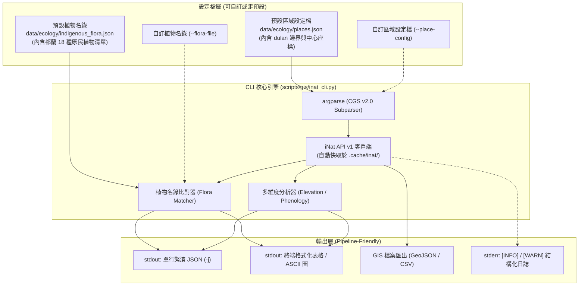

# 🌿 iNaturalist 在地生態系系與原民植物分析 CLI 規格書 (CGS v2.0)

> **版本**：v1.1 (CGS v2.0 合規，無硬編碼旗標，完全由設定檔與參數驅動)  
> **編寫日期**：2026-09-03  
> **歸檔路徑**：`events/classes/dulan-ai-hub-private/topics/inaturalist-dulan-flora-cli-spec.md`  
> **預計實作腳本**：`scripts/gis/inat_cli.py`  
> **手冊對齊**：`scripts/manuals/inat_cli.md`

---

## 🎯 1. 專案背景與核心目標

本專案旨在為台灣各地（首發為台東都蘭及東河鄉一帶）的生態系系觀測資料提供高度通用、模組化的系統分析工具。以 iNaturalist 上活躍的在地公民科學觀察家（如 `jimchen1`，累積 8,400+ 筆觀察紀錄）為切入點，結合傳統生活智慧，打造符合 **CLI 治理規範 (CGS v2.0)** 的專業命令列工具。

### 核心設計原則：
1. **零寫死專屬 Flag (No Hardcoded Region Flags)**：
   * **嚴禁**在 CLI 語法中建立硬編碼特定地名的旗標（如禁止 `--dulan`）。
   * 區域與邊界一律透過 `--place <name>`、`--place-config <path>`，或直接以座標參數（`--lat`, `--lng`, `--radius`, `--bbox`）動態傳入。
2. **預設設定檔驅動 (Default Config-Driven)**：
   * 系統內建預設區域設定檔與預設植物名錄設定檔，預設專案即包含「都蘭 (dulan)」空間定義與「都蘭阿美族 18 種原住民植物清單」。
   * 使用者若未顯式傳入檔案路徑，自動採用預設設定檔；亦可隨時切換任意自訂檔案。
3. **二階段下鑽與 Token 節省 (Two-Stage Drilldown & Token-Saving)**：
   * 列表搜尋預設輸出單行精簡摘要（節省 80% Token）；需深入檢視單筆照片與鑑定歷史時才發動 `fetch`。
4. **管線友善 (Pipeline-Friendly)**：
   * `stdout` 輸出純淨資料/JSON (`-j`)；`stderr` 輸出進度與結構化 Log。

---

## 🏛️ 2. 系統架構與設定檔驅動模型



---

## 📁 3. 預設設定檔規格 (Default Configurations)

### 3.1 區域定義檔：`data/ecology/places.json`
預設內建都蘭（支援邊界框 Bounding Box 與中心點半徑）：
```json
{
  "default": "dulan",
  "places": {
    "dulan": {
      "name": "台東都蘭 (東河鄉)",
      "description": "東河鄉都蘭村，涵蓋海岸帶、台11線至都蘭山稜線",
      "bbox": {
        "nelat": 22.92,
        "nelng": 121.25,
        "swlat": 22.84,
        "swlng": 121.18
      },
      "center": {
        "lat": 22.875,
        "lng": 121.21,
        "radius_km": 8.0
      }
    }
  }
}
```

### 3.2 植物名錄設定檔：`data/ecology/indigenous_flora.json`
預設內建 18 種都蘭原住民生活植物清單，以**學名（拉丁學名）**為主要比對識別鍵：
```json
{
  "region": "dulan",
  "ethnicity": "Amis",
  "title": "都蘭原住民傳統植物名錄",
  "species": [
    {
      "id": "flora-01",
      "category": "飲食與包材",
      "common_name": "林投",
      "indigenous_name": "'angroy",
      "family": "Pandanaceae",
      "scientific_name": "Pandanus tectorius",
      "notes": "常見海濱植物，海岸線點位豐富，防風編織食用。"
    },
    {
      "id": "flora-02",
      "category": "飲食與包材",
      "common_name": "假酸漿",
      "indigenous_name": "lavilu",
      "family": "Boraginaceae",
      "scientific_name": "Trichodesma calycosum",
      "notes": "原民阿拜 (haway) 必備包裹葉材，林緣常見。"
    },
    {
      "id": "flora-03",
      "category": "飲食與包材",
      "common_name": "樹豆",
      "indigenous_name": "vataan / fata'an",
      "family": "Fabaceae",
      "scientific_name": "Cajanus cajan",
      "notes": "部落農地或周邊野生/栽培紀錄，主食營養來源。"
    },
    {
      "id": "flora-04",
      "category": "飲食與包材",
      "common_name": "光果龍葵",
      "indigenous_name": "tatukem",
      "family": "Solanaceae",
      "scientific_name": "Solanum americanum",
      "notes": "野菜經典 (烏甜仔菜)，全台平野大量紀錄。"
    },
    {
      "id": "flora-05",
      "category": "飲食與包材",
      "common_name": "野生山苦瓜",
      "indigenous_name": "'alapit",
      "family": "Cucurbitaceae",
      "scientific_name": "Momordica charantia",
      "notes": "短包苦瓜，常紀錄為種層級 Momordica charantia。"
    },
    {
      "id": "flora-06",
      "category": "製麴與香草",
      "common_name": "大葉田香草",
      "indigenous_name": "faliyu",
      "family": "Plantaginaceae",
      "scientific_name": "Limnophila rugosa",
      "notes": "傳統酒麴靈魂香草，濕地/水田環境物種。"
    },
    {
      "id": "flora-07",
      "category": "製麴與香草",
      "common_name": "過山香",
      "indigenous_name": "rakaw",
      "family": "Rutaceae",
      "scientific_name": "Clausena excavata",
      "notes": "葉片具強烈辛香，低海拔向陽山坡常見。"
    },
    {
      "id": "flora-08",
      "category": "製麴與香草",
      "common_name": "食茱萸",
      "indigenous_name": "tana'",
      "family": "Rutaceae",
      "scientific_name": "Zanthoxylum ailanthoides",
      "notes": "刺蔥，嫩葉香料，次生林先驅樹種。"
    },
    {
      "id": "flora-09",
      "category": "製麴與香草",
      "common_name": "艾納香",
      "indigenous_name": "-",
      "family": "Asteraceae",
      "scientific_name": "Blumea balsamifera",
      "notes": "大風草，傳統青草、產婦藥浴與製麴常用。"
    },
    {
      "id": "flora-10",
      "category": "工藝與編織",
      "common_name": "構樹",
      "indigenous_name": "tapa",
      "family": "Moraceae",
      "scientific_name": "Broussonetia papyrifera",
      "notes": "鹿仔樹，樹皮布原料，荒地次生林極多。"
    },
    {
      "id": "flora-11",
      "category": "工藝與編織",
      "common_name": "黃藤",
      "indigenous_name": "'oway",
      "family": "Arecaceae",
      "scientific_name": "Calamus quiquesetinervius",
      "notes": "編織與建築骨幹，都蘭山林低中海拔常見。"
    },
    {
      "id": "flora-12",
      "category": "工藝與編織",
      "common_name": "月桃",
      "indigenous_name": "lengac",
      "family": "Zingiberaceae",
      "scientific_name": "Alpinia zerumbet",
      "notes": "葉鞘編織與包粽，低海拔林下極為普遍。"
    },
    {
      "id": "flora-13",
      "category": "工藝與編織",
      "common_name": "山棕",
      "indigenous_name": "dadok",
      "family": "Arecaceae",
      "scientific_name": "Arenga engleri",
      "notes": "蓑衣與掃帚纖維原料，森林中下層指標植物。"
    },
    {
      "id": "flora-14",
      "category": "節氣與特有種",
      "common_name": "刺桐",
      "indigenous_name": "tayuk",
      "family": "Fabaceae",
      "scientific_name": "Erythrina variegata",
      "notes": "阿美族曆法樹，春季開紅花代表新年到來與捕飛魚季節。"
    },
    {
      "id": "flora-15",
      "category": "節氣與特有種",
      "common_name": "台灣海棗",
      "indigenous_name": "toma",
      "family": "Arecaceae",
      "scientific_name": "Phoenix hanceana",
      "notes": "冰河孓遺特有種，台11線海崖指標植物。"
    },
    {
      "id": "flora-16",
      "category": "祭儀與避邪",
      "common_name": "荖藤",
      "indigenous_name": "da'dac",
      "family": "Piperaceae",
      "scientific_name": "Piper betle",
      "notes": "荖葉，祭儀供品與在地重要經濟作物。"
    },
    {
      "id": "flora-17",
      "category": "祭儀與避邪",
      "common_name": "檳榔",
      "indigenous_name": "'icep",
      "family": "Arecaceae",
      "scientific_name": "Areca catechu",
      "notes": "部落傳統生活與祭儀文化核心植物。"
    },
    {
      "id": "flora-18",
      "category": "祭儀與避邪",
      "common_name": "芙蓉菊",
      "indigenous_name": "-",
      "family": "Asteraceae",
      "scientific_name": "Crossostephium chinense",
      "notes": "蘄艾，避邪祈福植物，常栽植於庭院門前。"
    }
  ]
}
```

---

## 🛠️ 4. CLI 命令設計 (完全通用化)

腳本頂層宣告：`__cli_spec_version__ = "2.0"`

### 4.1 共通參數 (Global Flags)
* `-h, --help`：檢視說明。
* `-j, --json`：單行緊湊 JSON 輸出 (`separators=(',', ':')`)。
* `-q, --quiet`：極簡輸出。
* `-v, --verbose`：除錯日誌 (至 `stderr`)。
* `-n, --limit`：筆數上限（預設 20 筆防爆）。
* `-o, --output`：輸出檔案（支援 `-` 代表 stdout）。
* `--cache / --no-cache`：本機快取開關（預設啟用，快取至 `.cache/inat/`）。

### 4.2 空間與區域參數（跨子命令共用）
所有需要地理範圍的子命令，皆支援以下參數組合（無任何 hardcoded 旗標）：
* `--place <KEY>`：指定設定檔中的地區 key（預設為設定檔中的預設值 `"dulan"`）。若傳入 `--place any` 則代表不限區域。
* `--place-config <PATH>`：自訂區域設定檔路徑（預設自動讀取 `data/ecology/places.json`）。
* `--bbox <NELAT,NELNG,SWLAT,SWLNG>`：直接以四角座標涵蓋設定檔。
* `--lat <LAT> --lng <LNG> --radius <KM>`：直接以經緯度與半徑涵蓋設定檔。

### 4.3 子命令規劃

#### ① `user`：觀察者畫像摘要
```bash
python scripts/gis/inat_cli.py user <username> [-j]
```
* **範例**：`python scripts/gis/inat_cli.py user jimchen1`
* **回傳**：觀察者 ID、真實姓名、總觀察數、物種數、鑑定數、研究級比例。

#### ② `search`：輕量檢索（第一階段）
```bash
python scripts/gis/inat_cli.py search [--user USER] [--taxon TAXON] [--place PLACE] [--quality {research,needs_id,any}] [-n LIMIT] [-j]
```
* **範例**：
  ```bash
  # 查詢 jimchen1 在預設地區 (都蘭) 的觀察
  python scripts/gis/inat_cli.py search --user jimchen1

  # 查詢不限地區的特定物種
  python scripts/gis/inat_cli.py search --taxon "Erythrina variegata" --place any
  ```

#### ③ `fetch`：單筆完整資料下鑽（第二階段）
```bash
python scripts/gis/inat_cli.py fetch <observation_id> [-j]
```
* **回傳**：高畫質照片 URL、精確經緯度、海拔高程、鑑定意見與時間軸。

#### ④ `match-flora`：原住民植物名錄對照整合比對
```bash
python scripts/gis/inat_cli.py match-flora [--user USER] [--place PLACE] [--flora-file PATH] [-j]
```
* **參數運作**：
  * `--flora-file`：指定植物名錄檔案（預設為 `data/ecology/indigenous_flora.json`）。
  * `--place`：限定比對地區（預設為 `"dulan"`；亦可指定 `--place any` 比對該觀察者全台紀錄）。
* **分析輸出指標**：
  * **涵蓋率**：名錄命中數量與百分比（例如：18 種中記錄了 14 種，命中率 77.8%）。
  * **物種命中明細表**：族語名、俗名、拉丁學名、觀察次數、最早/最近記錄日期。
  * **生態系系空缺清單**：名錄中有但該觀察者尚未記錄的植物（供未來田野踏查參考）。

#### ⑤ `analyze`：生態系多維度分析
```bash
python scripts/gis/inat_cli.py analyze --user USER [--mode {elevation,phenology,both}] [--flora-file PATH] [--place PLACE] [-j]
```
* **模式說明**：
  * `elevation`（海拔垂直梯度）：
    * 分組級距：海岸帶 (<50m)、平原聚落帶 (50~200m)、淺山坡地 (200~500m)、山林中高海拔 (>500m)。
    * 呈現植物隨海拔高度的分層分佈。
  * `phenology`（物候季節性）：
    * 統計 1~12 月份各植物之觀察次數與頻率。
    * 特別突顯阿美族歲時節氣指標植物（如刺桐 2~4 月紅花期）。

#### ⑥ `export`：空間圖資匯出
```bash
python scripts/gis/inat_cli.py export --user USER [--place PLACE] [--format {geojson,csv}] -o <OUTPUT_PATH>
```
* **功能**：將紀錄點轉換為標準 GeoJSON/CSV，可無縫載入 QGIS 或 WalkGIS。

#### ⑦ `schema`：自我描述 JSON Schema
```bash
python scripts/gis/inat_cli.py schema
```

---

## 🛡️ 5. 架構健全性原則 (Robustness Patterns)

1. **零寫死原則 (No Hardcoded Paths/Keys)**：
   * 專案內使用動態 `WORKSPACE_ROOT` 取得設定檔路徑。
   * 允許透過環境變數或 CLI 旗標完全覆寫設定檔。
2. **網路沙盒與快取防護 (Network & Cache)**：
   * 內建基於檔案 SHA256 的快取機制，預設快取 24 小時，避免高頻重複查詢 iNaturalist API 導致封鎖。
   * 請求 header 加入合法標識：`User-Agent: bmad-pa-inat-cli/2.0`。
3. **繁體中文在地化 (Taiwan Locale)**：
   * iNaturalist API 參數固定帶入 `locale=zh-TW` 與 `preferred_place_id=7140`（台灣程式碼），優先呈現繁體中文俗名。
