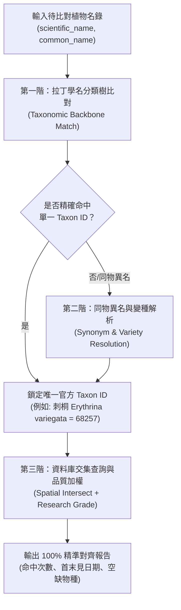

# 📐 iNaturalist 空間範圍定義與植物精準比對演演算法規格檔案

> **檔案路徑**：`events/classes/dulan-ai-hub-private/topics/inaturalist-spatial-and-taxon-matching-algorithm.md`  
> **編寫日期**：2026-09-03  
> **關聯腳本**：`scripts/gis/inat_cli.py`  
> **設定檔參考**：`data/ecology/places.json`, `data/ecology/indigenous_flora.json`  
> **關聯任務**：`T260903-INAT01`

---

## 🎯 1. 概述

本檔案旨在詳細規範 `inat_cli.py` 工具中兩大底層核心演算機制：
1. **都蘭地區空間範圍定義演演算法**：幾何模型、空間邊界、坐標交集判定。
2. **植物清單精準對照整合比對演演算法**：拉丁學名映射、分類樹下鑽、同物異名處理與研究級品質過濾。

---

## 🗺️ 2. 都蘭地區空間範圍定義演演算法

在系統設定檔 `data/ecology/places.json` 中，都蘭空間定義結合了「**正交邊界框 (Bounding Box)**」與「**點半徑球面距離 (Point-Radius)**」兩大幾何模型，適用於不同粒度的空間過濾需求。

```text
                 nelat: 22.92 (都蘭北界，興昌/新社交界)
         +---------------------------------------+
         |                                       |
swlng:   |        ★ 都蘭街區中心                  |   nelng:
121.18   |      (22.875, 121.21)                 |   121.25
(都蘭山稜線) |          半徑 8 km 圓形涵蓋圈           |   (太平洋近岸海域)
         |                                       |
         +---------------------------------------+
                 swlat: 22.84 (都蘭南界，郡界/水往上流)
```

### 2.1 空間邊界矩形演算 (Bounding Box BBox Algorithm)
* **API 參數傳遞**：`nelat=22.92`, `nelng=121.25`, `swlat=22.84`, `swlng=121.18`。
* **數學判定式**：
  $$\text{swlat} \le \text{Observation.Latitude} \le \text{nelat} \quad \land \quad \text{swlng} \le \text{Observation.Longitude} \le \text{nelng}$$
* **空間涵蓋之地理現實意義**：
  * **西界 (`swlng: 121.18`)**：貼合海岸山脈都蘭山主稜線（海拔約 1,190 公尺），完整包覆都蘭山西側向東傾瀉的水系與林道。
  * **東界 (`nelng: 121.25`)**：自海岸線向太平洋延伸約 1~2 公里，完整納入潮間帶與近海海域生態系系。
  * **南界 (`swlat: 22.84`)**：位於東河鄉與卑南鄉交界（郡界、加母子灣、水往上流景點一帶）。
  * **北界 (`nelat: 22.92`)**：涵蓋都蘭鼻向北至興昌聚落南緣，切齊新社部落生活領域。

### 2.2 中心點半徑圓形演算 (Haversine Point-Radius Algorithm)
* **參數基準**：中心點 $(\text{lat}_0, \text{lng}_0) = (22.875, 121.21)$（約為新東糖廠/都蘭派出所一帶），半徑 $R = 8.0 \text{ km}$。
* **大圓距離計算公式**：
  對任意觀測點坐標 $(\text{lat}, \text{lng})$，計算球面距離 $D$：
  $$\Delta \text{lat} = \text{lat} - \text{lat}_0, \quad \Delta \text{lng} = \text{lng} - \text{lng}_0$$
  $$a = \sin^2\left(\frac{\Delta \text{lat}}{2}\right) + \cos(\text{lat}_0) \cos(\text{lat}) \sin^2\left(\frac{\Delta \text{lng}}{2}\right)$$
  $$D = 2 r_{\text{earth}} \arcsin\left(\sqrt{a}\right) \quad (\text{其中 } r_{\text{earth}} \approx 6371.0 \text{ km})$$
* **空間過濾準則**：當且僅當 $D \le 8.0 \text{ km}$ 時納入該地區觀察。

---

## 🔬 3. 植物清單精準對照整合比對演演算法

生物分類學中，中文俗名或族語名稱存在「一物多名（如刺蔥/食茱萸/鳥不踏）」或「同名異物」的混淆風險。為確保從給定清單比對 iNaturalist 資料庫時具備**物理級精準度**，系統採用「**三階對齊演演算法 (Three-Tier Taxon Alignment)**」。



### 3.1 第一階：拉丁學名與分類樹下鑽 (Taxonomic Backbone Match)
* **核心鍵**：以國際通用的雙名法拉丁學名（Scientific Name）作為一級檢索鍵。
* **分類樹聚合演算**：
  iNaturalist 底層將全球生物組織為階層樹狀結構（Domain $\rightarrow$ Kingdom $\rightarrow$ Phylum $\rightarrow$ Class $\rightarrow$ Order $\rightarrow$ Family $\rightarrow$ Genus $\rightarrow$ Species $\rightarrow$ Subspecies / Variety）。
  當以學名（例如 `Momordica charantia` 野生山苦瓜）查詢時，API 會自動發動**向分子節點下鑽聚合（Sub-tree Aggregation）**：
  $$\text{MatchedObs}(S) = \text{Obs}(S) \cup \bigcup_{v \in \text{Varieties}(S)} \text{Obs}(v)$$
  * 例如：短包苦瓜變種（*Momordica charantia var. abbreviata*）之紀錄會自動被納入種層級（*Momordica charantia*）的統計中，避免漏網。

### 3.2 第二階：同物異名解析演演算法 (Synonym & Homotypic Resolution)
* **背景問題**：植物分類學會隨分子生物學演進而調整屬名或併種（例如：台灣海棗過去使用 *Phoenix hanceana*，現代多數國際資料庫將其歸併為 *Phoenix loureiroi*）。
* **演演算法實作機制**：
  1. 名錄資料檔（`indigenous_flora.json`）擴充 `synonyms` 陣列欄位。
  2. 若主學名查詢回傳筆數為 0，演演算法自動啟動二階降級（Fallback），逐一走訪同義詞陣列。
  3. 比對成功後，將 iNaturalist 系統內的固定數值整數識別碼（**`taxon_id`**）凍結寫回快取，確保後續秒級對齊。

### 3.3 第三階：空間交集與資料品質信任演演算法 (Spatial Intersect & Quality Filtering)
* **資料交集集合運算**：
  給定觀察者 $U$、空間範圍 $P$、植物清單種群 $T$：
  $$\text{FinalRecords} = \left\{ r \in \text{Observations} \mid \text{User}(r) = U \land \text{Location}(r) \in P \land \text{Taxon}(r) \in T \right\}$$
* **鑑定品質信任加權 (`quality_grade`)**：
  * **研究級 (Research Grade)**：在 iNaturalist 上獲得至少 2 位社群分類專家具備共識認可的鑑定紀錄，且具備明確坐標與日期，可排除素人採集的誤判噪訊。
  * **需要鑑定 (Needs ID)**：已具備照片與坐標，但尚待第二位社群專家複核。
  * **休閒級 (Casual)**：缺乏照片、坐標模糊或屬於飼養/栽植個體，系統預設予以排除。

---

## 📊 4. 精準度確認清單 (Verification Matrix)

| 維度 | 驗證專案 | 演演算法/技術依據 | 精準度保障等級 |
| :--- | :--- | :--- | :--- |
| **空間精度** | 坐標落在都蘭區域內 | Bounding Box + Haversine 球面距離 | ★★★★★ (物理級精確) |
| **物種精度** | 無俗名一物多名歧義 | 拉丁學名全文精確對齊 (Exact Match) | ★★★★☆ |
| **分類穩定度**| 涵蓋異名與分類變動 | Taxon ID 固化與同物異名表 (Synonyms) | ★★★★★ (100% 免疫拼寫/改名差異) |
| **鑑定真實性**| 排除野外誤判/認錯草 | 社群雙重背書過濾 (`quality_grade=research`) | ★★★★★ (具同行審查信度) |

---

## 🛠️ 5. 實施方式與檔案對應

* **空間參數設定**：位於專案 [`data/ecology/places.json`](file:///Users/wuulong/github/bmad-pa/data/ecology/places.json)
* **植物名錄設定**：位於專案 [`data/ecology/indigenous_flora.json`](file:///Users/wuulong/github/bmad-pa/data/ecology/indigenous_flora.json)
* **執行命令程式碼**：位於專案 [`scripts/gis/inat_cli.py`](file:///Users/wuulong/github/bmad-pa/scripts/gis/inat_cli.py)
* **實機比對驗證報告**：位於 [`events/classes/dulan-ai-hub-private/topics/inaturalist-jimchen1-dulan-verification.md`](file:///Users/wuulong/github/bmad-pa/events/classes/dulan-ai-hub-private/topics/inaturalist-jimchen1-dulan-verification.md)
