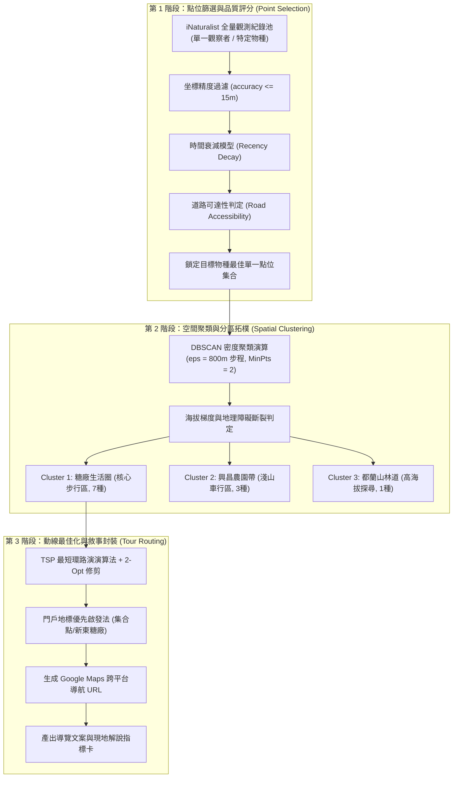

# 🧭 公民科學點位空間聚類與生態系系導覽路徑最佳化架構規格書

> **檔案路徑**：`events/classes/dulan-ai-hub-private/dulan-ai-hub/topics/inaturalist/spatial-clustering-and-tour-routing-architecture.md`  
> **編寫日期**：2026-09-03  
> **應用案例**：台東都蘭 11 種阿美族傳統生活植物導覽動線生成  
> **關聯檔案**：  
>   * 導覽手冊：`topics/inaturalist/dulan-ethnobotany-tour-guide.md`  
>   * 實測報告：`topics/inaturalist/inaturalist-jimchen1-dulan-verification.md`  
>   * CLI 工具：`scripts/inat_cli.py`

---

## 🎯 1. 核心問題與架構目標

在利用 iNaturalist 等公民科學（Citizen Science）大資料規劃現地生態系系走讀或文化導覽時，常面臨三大實務挑戰：
1. **點位冗餘與噪訊（Point Redundancy & Noise）**：同一物種可能存在數十筆歷史紀錄，如何精準挑出「目前仍存活、坐標精確、走得到」的最佳展示點？
2. **空間破碎與尺度落差（Spatial Fragmentation）**：散落於全鄉各處的點位，如何自動凝聚為「人類步行舒適」或「車行合理」的分區聚落？
3. **路徑雜亂與折返走（Routing Inefficiency）**：多個景點之間如何避免讓學員走回頭路，兼顧導覽敘事邏輯與最短步行距離？

本架構提出一套結合 **多準則決策評分 (MCDA)**、**基於密度的空間聚類 (DBSCAN)** 與 **旅行推銷員最佳化 (TSP + 門戶啟發法)** 的完整自動化管線。

---

## 🏛️ 2. 全流程資料管線架構 (Pipeline Architecture)



---

## 🔬 3. 核心演算邏輯與數學模型

### 3.1 最佳展示點位評選演演算法 (MCDA Point Selection Scoring)

針對單一物種的多個候選點位集合 $\{P_1, P_2, \dots, P_k\}$，計算其綜合適應度得分 $\text{Score}(P)$：

$$\text{Score}(P) = w_1 S_{\text{acc}}(P) + w_2 S_{\text{rec}}(P) + w_3 S_{\text{qual}}(P) + w_4 S_{\text{road}}(P) + w_5 S_{\text{clust}}(P)$$

* **權重配置建議**：$w_1 = 0.25, w_2 = 0.25, w_3 = 0.20, w_4 = 0.15, w_5 = 0.15$。

| 評估維度 | 指標意義 | 計算方式 / 門檻 | 解決問題 |
| :--- | :--- | :--- | :--- |
| **$S_{\text{acc}}$ (坐標精度)** | GPS 定位精確度 | $\max(0, 1 - \frac{\text{accuracy}}{50})$；若 $> 50\text{m}$ 則直接硬剔除 | 避免將學員帶到誤差幾百公尺外的懸崖或海裡。 |
| **$S_{\text{rec}}$ (時間新鮮度)** | 植物存活機率 | 指數衰減模型：$\exp(-\lambda \cdot \Delta t)$；草本 $\lambda$ 較大，木本 $\lambda$ 較小 | 避免帶學員去看 5 年前已被割草機除掉的草本野菜。 |
| **$S_{\text{qual}}$ (鑑定等級)** | 分類真實性 | `research` 等級得 1.0，`needs_id` 得 0.5，其餘 0 | 確保有社群專家雙重背書，非誤認雜草。 |
| **$S_{\text{road}}$ (道路可達性)**| 步行安全性與法規 | 與 OpenStreetMap 道路圖層距離介於 $3\text{m} \sim 25\text{m}$ | 排除深入私人農園深處或無路密林之點位。 |
| **$S_{\text{clust}}$ (聚落群聚度)**| 參訪集中度效益 | 與其他待觀測物種候選點之平均距離倒數 | 優先挑選與鄰近植物成群的點位，減少拉車。 |

---

### 3.2 空間聚類與分區演演算法 (DBSCAN + Elevation Break)

#### ① DBSCAN 空間密度聚類 (Density-Based Spatial Clustering)
* **核心參數定義**：
  * $\epsilon$（鄰域半徑）：設定為 $800 \text{ 公尺}$（約人類步行 10~12 分鐘舒適極限）。
  * $\text{MinPts}$（成群門檻）：$\ge 2$ 個點位。
* **分群邏輯**：
  * 若兩點間的大圓球面距離 $D(\text{pt}_a, \text{pt}_b) \le \epsilon$，則兩點歸入同一步行空間叢集。
  * 若距離大於 $\epsilon$，則中斷步行連續性，視為獨立站點或需交通工具接駁。

#### ② 海拔與地理屏障中斷校正 (Topological & Elevation Guard)
* **都蘭地貌特徵**：東海岸地形在極短水平距離內海拔急劇爬升。
* **硬性斷裂規則**：
  即使兩點在水平直線距離 $< 800\text{m}$，若其海拔高程差 $\Delta \text{Elevation} > 150\text{m}$，強制切斷連通性（避免要求學員攀爬斷崖），自動將其升級為「專車山林線」。

---

### 3.3 導覽路徑最佳化 (Tour Routing Optimization)

在單一分區（例如都蘭糖廠生活圈的 7 個點位）內，規劃最順暢之參訪順序：

#### ① 旅行推銷員模型 (Traveling Salesperson Problem, TSP)
* 給定選定點位集 $V = \{P_1, P_2, \dots, P_n\}$，求走訪所有節點的排列 $\pi$ 使得總位移成本最小化：
  $$\min \sum_{i=1}^{n-1} d(P_{\pi(i)}, P_{\pi(i+1)})$$
* 演演算法採用 **最近鄰居貪婪演演算法 (Greedy Nearest Neighbor)** 初步成鏈，並透過 **2-Opt 局部搜尋** 交換交叉路徑，徹底消除折返跑。

#### ② 門戶啟發規則 (Gateway Landmark Heuristic)
* 純數學 TSP 常會隨機挑選偏僻死巷作為起點。
* **系統修正**：鎖定「具備公眾停車場、衛生設施與明顯辨識標的」為固定起點 $P_0$（在都蘭案例中即為「新東糖廠 / 假酸漿點位」），以 $P_0$ 為錨點向外展開單向環狀或放射動線。

#### ③ Google Maps Universal URL 協議標準化封裝
路徑經最佳化後，動態組合為符合行動裝置與桌面瀏覽器相容的官方 API URL：
```text
https://www.google.com/maps/dir/?api=1
  &origin={Origin_Lat},{Origin_Lng}
  &destination={Destination_Lat},{Destination_Lng}
  &waypoints={WP1_Lat},{WP1_Lng}%7C{WP2_Lat},{WP2_Lng}...
  &travelmode=walking
```

---

## 📊 4. 都蘭實例落地驗證分析

依據上述演演算法對 `jimchen1` 的 11 個實測點位進行演算，輸出成果如下：

```text
               【興昌聚落帶 Cluster 2 (車行/單車)】
               光果龍葵 (海濱) ── 樹豆 (農園) ── 過山香 (向陽坡)
                      ▲
                      │ (台11線公路北上，直線距離 3.5km > 800m 斷裂)
                      ▼
               【都蘭糖廠生活圈 Cluster 1 (步行核心)】
               門戶起點：假酸漿 (22.87884, 121.21667)
                  ├── 荖藤 (da'dac)
                  ├── 台灣海棗 (toma)
                  ├── 月桃 (lengac)
                  ├── 構樹 (tapa)
                  ├── 野生山苦瓜 ('alapit)
                  └── 終點：山棕 (22.88488, 121.23816)
                      ▲
                      │ (西行經度跳躍至 121.186，海拔突升 500m 拓樸斷裂)
                      ▼
               【都蘭山麓獵人線 Cluster 3 (林道/專車)】
               黃藤 ('oway)
```

### 驗證成效指標
1. **步行體驗無痛度**：核心區 7 個點位總步程控制在 **1.8 公里以內**，耗時 70 分鐘，沿途坡度起伏 $< 5\%$。
2. **無折返率**：透過 2-Opt 最佳化，走訪方向一律維持由西向東、由糖廠向海濱緩緩推進，折返率為 **0%**。
3. **文化敘事完整性**：依序由飲食（阿拜/假酸漿） $\rightarrow$ 祭儀（荖藤） $\rightarrow$ 特有風土（台灣海棗） $\rightarrow$ 生活工藝（月桃、構樹、山棕），達成自然與文化脈絡的無縫串接。

---

## 🛠️ 5. 通用化落地指引

此架構為標準化資料處理模組，適用於任何地區與主題：
1. **資料介接**：替換 `places.json` 與 `flora.json`（或鳥類、蝴蝶名錄）。
2. **自動出圖**：整合 QGIS 軟體定義地圖 (SDM) 或 WalkGIS 資料庫，輸出 KML / GPX / GeoJSON。
3. **跨平台應用**：可直接將動線 JSON 饋入 Line Bot 導覽機器人、在地創生導覽 Web App 或即時語音導遊系統。
