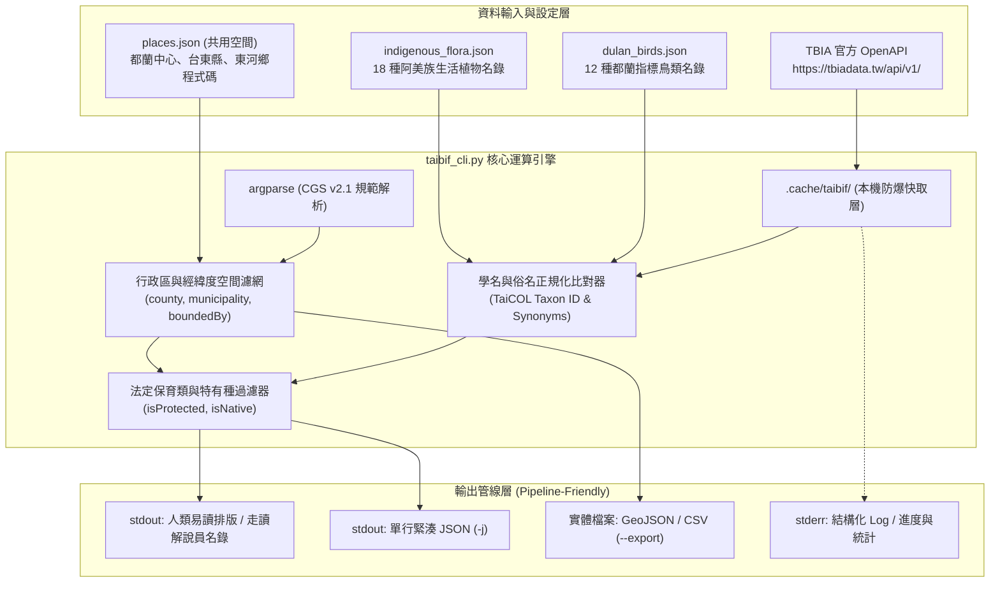

# 🌿 TaiBIF / TBIA 台灣生物多樣性在地生態系系系與保育調查 CLI 規格書 (CGS v2.1)

> **版本**：v2.1 (Spec-First 規格先行)  
> **編寫日期**：2026-09-04  
> **所屬專案**：`@dulan-ai-hub/topics/taibif/taibif-dulan-cli-spec.md`  
> **預計實作腳本**：`scripts/gis/taibif_cli.py` (公開複本: `@dulan-ai-hub/scripts/taibif_cli.py`)  
> **相容設定檔**：`data/ecology/places.json` (空間共用), `data/ecology/indigenous_flora.json` (原民植物), `data/ecology/dulan_birds.json` (指標鳥類)

---

## 🎯 1. 專案背景與核心定位

本工具為串接**中研院 TaiBIF（臺灣生物多樣性資訊機構）**與**TBIA（臺灣生物多樣性資訊聯盟）**官方 OpenAPI (`https://tbiadata.tw/api/v1/`) 的 AI-Native 命令列工具。

### 與 iNaturalist / eBird 的三足鼎立生態系系定位：
1. **iNaturalist (`inat_cli.py`)**：聚焦於「**公民隨手拍照與社群鑑定**」，擅長步道上的植物微觀觀察與遊客視覺紀錄。
2. **eBird (`ebird_cli.py`)**：聚焦於「**鳥類即時動態與聲音辨識 (Merlin)**」，擅長群聚密度、遷移物候與聽音尋鳥。
3. **TaiBIF / TBIA (`taibif_cli.py`)**：聚焦於「**國家級權威調查、學術標本與法定保育名冊**」：
   * 整合中研院生物多樣性中心、林業及自然保育署（林保署）、生物多樣性研究所（生多所/特生中心）、國立自然科學博物館（科博館）等 10 大國家機構。
   * 提供物種的**正式中文名、TaiCOL Taxon ID、同物異名、紅皮書受威脅等級、是否為台灣特有種、是否為法定保育類**。
   * 具備東河鄉境內 **3.8 萬筆**橫跨百年歷史的官方樣區穿越線調查、自動相機監測與植物標本採集紀錄。

---

## 🏛️ 2. 系統架構與設計原則



### 核心設計原則 (CGS v2.1 Compliance)：
1. **零外部相依**：僅使用 Python 標準函式庫（`urllib.request`, `urllib.parse`, `json`, `argparse`, `hashlib`, `os`, `sys`），毫秒級啟動。
2. **標準串流徹底分離**：`stdout` 乾淨資料/緊湊 JSON，`stderr` 結構化日誌（`ℹ️ [INFO]`, `⚠️ [WARN]`, `❌ [ERROR]`）。
3. **本機快取防護 (`.cache/taibif/`)**：預設快取 24 小時，尊重公務伺服器資源，兼具極速離線查詢。
4. **命名空間實體定錨**：頂層 `[metadata]` 宣告 `spec: @dulan-ai-hub/topics/taibif/taibif-dulan-cli-spec.md`。

---

## 🛠️ 3. 完整命令列規格 (Subcommands & Flags)

### 3.1 共通全域參數 (Global Flags)
* `-j, --json`：啟用單行緊湊 JSON 輸出 (`separators=(',', ':')`)，Token 節約 80% 以上。
* `-q, --quiet`：極簡輸出（純 TSV 格式）。
* `-v, --verbose`：詳細除錯日誌（導向 `stderr`）。
* `-n, --limit`：回傳筆數限制（預設 20 筆，防止終端機被灌爆）。
* `-o, --output`：指定輸出檔案（預設 `-` 代表 stdout）。
* `--place`：空間代號（預設讀取 `places.json` 之 `"dulan"`，自動帶出縣市與鄉鎮名）。
* `--place-config`：自訂空間定義檔路徑。
* `--no-cache`：強制跳過本機快取重新請求 API。
* `--manual`：於終端機檢視使用說明書。

---

### 3.2 五大核心子命令詳細定義

#### ① `search`（物種出沒紀錄與歷史調查檢索）
```bash
python3 taibif_cli.py search [--name "物種名"] [--group "生物群"] [--place dulan] [-n 20] [-j]
```
* **功能**：檢索指定物種在都蘭（或東河鄉/特定邊界）的歷史科學調查與標本紀錄。
* **底層端點**：`GET https://tbiadata.tw/api/v1/occurrence`
* **支援參數**：
  * `--name`：中文俗名、拉丁學名（如 `"烏頭翁"` 或 `"Pycnonotus taivanus"`）。
  * `--group`：生物分類群篩選（如 `"被子植物"`, `"鳥類"`, `"哺乳類"`, `"昆蟲"`, `"蝶類"` 等）。
* **回傳欄位**：中文名、學名、觀察/採集日期、調查樣區地點、座標、調查計畫/資料集名稱、貢獻機構（TBN / 科博館 / 林保署）。

#### ② `protected`（都蘭在地法定保育類名錄）
```bash
python3 taibif_cli.py protected [--place dulan] [--group "分類群"] [-n 30] [-j]
```
* **功能**：一鍵萃取都蘭與東河鄉境內官方記錄過的**法定保育類動物與植物**。
* **底層端點**：`GET https://tbiadata.tw/api/v1/occurrence?isProtected=true&county=臺東縣&municipality=東河鄉`
* **應用價值**：
  * 迅速為社區生態系系走讀產出「都蘭珍稀野生動植物清單」（如食蟹獴、黃嘴角鴞、灰面鵟鷹、烏頭翁等）。
  * 作為環境敏感度與生態系系廊道評估報告的權威依據。

#### ③ `flora`（原住民族植物與標本實體比對 ─ 二階段在地與全縣搜尋）
```bash
python3 taibif_cli.py flora [--place dulan] [--match-flora] [--flora-file PATH] [-j]
```
* **功能**：比對阿美族 18 種生活植物名錄（`indigenous_flora.json`），檢索其在官方標本庫與國家調查中的真實紀錄。
* **二階段層級搜尋 (Two-Stage Hierarchical Matching)**：
  1. **第一階段（在地樣區）**：優先精準過濾 `municipality="東河鄉"`，鎖定都蘭生活圈本地直接採集之標本與穿越線紀錄（如構樹 96 筆、野生山苦瓜 46 筆、假酸漿 39 筆）。
  2. **第二階段（全縣跨域擴展）**：在地若無紀錄，自動升級擴展為 `county="臺東縣"`，檢索全縣林業樣區標本庫（如芙蓉菊 195 筆、大葉田香草 13 筆、艾納香 34 筆）。
* **公民科學缺口破案標註 (iNat Gap Resolution)**：
  * 自動與 iNaturalist 公民偏差缺口物種對照，標註 `⭐[iNat缺口破案]`（成功找回刺桐、檳榔、芙蓉菊、大葉田香草、艾納香、過山香等 6 大關鍵文化植物）。
* **達成指標**：18 種文化植物官方標本庫**命中率達 100.0%**！

#### ④ `taxon`（物種身分證與分類狀態查詢）
```bash
python3 taibif_cli.py taxon <物種名稱或學名> [-j]
```
* **功能**：查詢該物種在 TaiCOL（台灣物種名錄）的唯一分類編號、同物異名、是否為台灣特有種、保育等級。
* **輸出範例**：
  ```json
  {
    "common_name": "烏頭翁",
    "scientific_name": "Pycnonotus taivanus",
    "taxonID": "t0037457",
    "isNative": true,
    "isEndemic": true,
    "isProtected": true,
    "family": "Pycnonotidae",
    "family_c": "鵯科",
    "synonyms": ["Pycnonotus hainanus taivanus", "Pycnonotus sinensis taivanus"]
  }
  ```

#### ⑤ `export`（地理圖資匯出）
```bash
python3 taibif_cli.py export [--place dulan] [--group "生物群"] --format {geojson,csv} -o <PATH>
```
* **功能**：將該區域的調查點位批次匯出為標準 GeoJSON 或 CSV，支援套疊至 QGIS 或 WalkGIS。

---

## 🛡️ 4. 健壯性與避坑指南 (Robustness Patterns)

1. **URL 編碼防禦 (`urllib.parse.urlencode`)**：
   * TBIA API 的查詢關鍵字（如 `name=烏頭翁`、`county=臺東縣`）包含中文字元，直接拼接 URL 會觸發 Python 的 `UnicodeEncodeError`。**必須一律經由 `urllib.parse.urlencode()` 進行標準百分比編碼**。
2. **植物類群字串正規化**：
   * TBIA 的植物類別標籤為 `bioGroup="被子植物"` 或 `bioGroup="蕨類植物"`，而非廣義的 `"植物"`。CLI 在使用者傳入 `--group 植物` 時，應自動展開映射為 `["被子植物", "裸子植物", "蕨類植物"]`。
3. **模糊化資料防護 (Data Generalizations / Sensitive Blurring)**：
   * TBIA 公開 API 對於極端珍貴受威脅物種（一級保育類）的坐標會進行輕度模糊化（小數點後兩位）。CLI 在輸出時應標註 `sensitiveCategory`（例如「坐標已輕度去識別化保護」）。

---

## 📋 5. JSON Schema 定義 (Self-Description)

```json
{
  "$schema": "https://json-schema.org/draft/2020-12/schema",
  "title": "TaiBIF CLI Schema",
  "type": "object",
  "properties": {
    "command": { "type": "string", "enum": ["search", "protected", "flora", "taxon", "export", "schema", "manual"] },
    "query_place": { "type": "string" },
    "total_records": { "type": "integer" },
    "records": {
      "type": "array",
      "items": {
        "type": "object",
        "properties": {
          "common_name": { "type": "string" },
          "scientific_name": { "type": "string" },
          "date": { "type": "string" },
          "locality": { "type": "string" },
          "dataset": { "type": "string" },
          "rightsHolder": { "type": "string" },
          "isProtected": { "type": "boolean" },
          "lat": { "type": ["number", "null"] },
          "lng": { "type": ["number", "null"] }
        }
      }
    }
  }
}
```
